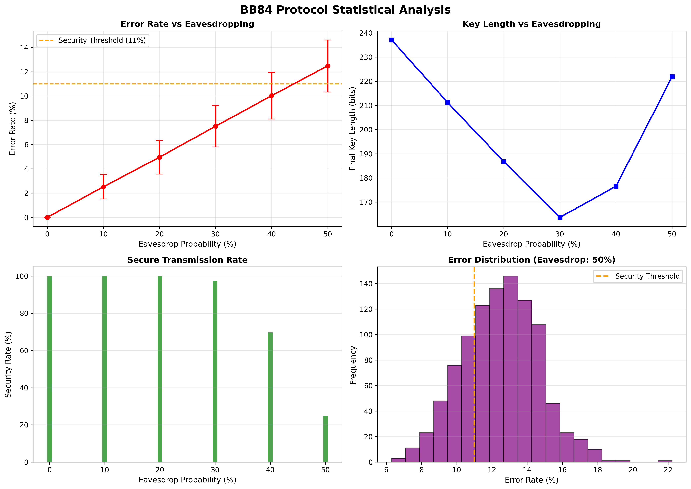
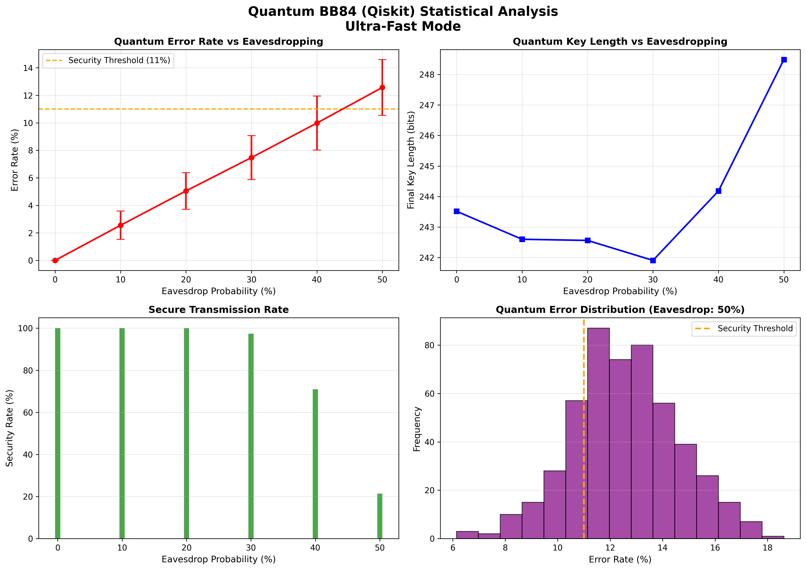

# BB84 Quantum Key Distribution Simulator


A comprehensive Python implementation of the BB84 quantum key distribution protocol featuring both **classical simulation** and **actual quantum circuit simulation** using Qiskit. First proposed by Charles Bennett and Gilles Brassard in 1984.

## Overview

This project provides two complete implementations of the BB84 protocol:

###  **Classical Implementation**
- Simulates BB84 using classical bits and probability calculations
- Fast execution for large-scale statistical analysis
- Perfect for understanding protocol mechanics

###  **Quantum Implementation (Qiskit)**
- Uses actual quantum circuits and measurements
- Simulates real quantum hardware behavior
- Includes quantum noise and measurement statistics

Both implementations include:
- Quantum bit preparation and transmission
- Eavesdropping attack simulation
- Basis reconciliation (sifting)
- Error rate estimation
- Statistical analysis with multiple runs
- Comprehensive visualization and plotting

## Features

### Core Protocol Features
- ✅ Complete BB84 protocol implementation (Classical & Quantum)
- ✅ Eavesdropping detection and simulation
- ✅ Basis reconciliation (sifting) - ~50% key retention
- ✅ Error rate estimation with configurable sampling
- ✅ Privacy amplification using SHA-256 hash function
- ✅ Security analysis with 11% error threshold

### Analysis & Visualization
- ✅ Statistical analysis with multiple simulation runs
- ✅ Performance metrics (error rates, key lengths, security rates)
- ✅ Automated plotting of results
- ✅ Correlation analysis between eavesdropping and key efficiency
- ✅ Execution time tracking and optimization

### Implementation Details
- ✅ **Classical**: Fast probabilistic simulation
- ✅ **Quantum**: Qiskit-based quantum circuit simulation

## Installation

```bash
# Clone the repository
git clone https://github.com/lukeshim03/bb84-simulator.git
cd bb84-simulator

# Install dependencies
pip install -r requirements.txt
```

## Quick Start

### Classical Implementation

```python
from classical.bb84_simulator import BB84Protocol

# Create protocol instance
bb84 = BB84Protocol(key_length=100, eavesdrop_prob=0.25)

# Run simulation
results = bb84.run()

# Print results
bb84.print_results()
```

### Quantum Implementation

```python
from quantum.bb84_quantum import BB84QuantumProtocol

# Create quantum protocol instance
bb84 = BB84QuantumProtocol(key_length=100, eavesdrop_prob=0.25, shots=1000)

# Run quantum simulation
results = bb84.run()

# Print results
bb84.print_results()
```

### Statistical Analysis

#### Classical Analysis
```python
from classical.statistical_analysis import BB84StatisticalAnalyzer

analyzer = BB84StatisticalAnalyzer()
analyzer.analyze_eavesdrop_impact(
    key_length=1000,
    eavesdrop_probs=[0.0, 0.1, 0.2, 0.3, 0.4, 0.5],
    num_simulations=500
)
analyzer.print_statistics()
analyzer.plot_results()  # Saves 'bb84_statistical_analysis.png'
```

#### Quantum Analysis
```python
from quantum.statistical_analysis_qiskit import QuantumBB84StatisticalAnalyzer

analyzer = QuantumBB84StatisticalAnalyzer()
analyzer.analyze_eavesdrop_impact(
    key_length=1000,
    eavesdrop_probs=[0.0, 0.1, 0.2, 0.3, 0.4, 0.5],
    num_simulations=500,
    shots=1000
)
analyzer.print_statistics()
analyzer.plot_results()  # Saves 'quantum_bb84_statistical_analysis.png'
```

### Run Complete Demos

```bash
# Classical implementation demo
python classical/main.py

# Quantum implementation demo
python quantum/main_quantum.py
```

## Project Structure

```
BB84-Quantum-Key-Distribution-Simulator/
├── README.md
├── requirements.txt
├── LICENSE
├── classical/                    # Classical implementation
│   ├── __init__.py
│   ├── bb84_simulator.py        # Core classical BB84 protocol
│   ├── statistical_analysis.py  # Classical statistical analysis
│   ├── main.py                  # Classical demo
│   └── __pycache__/
├── quantum/                      # Quantum implementation
│   ├── __init__.py
│   ├── bb84_quantum.py          # Core quantum BB84 protocol (Qiskit)
│   ├── statistical_analysis_qiskit.py  # Quantum statistical analysis
│   ├── main_quantum.py          # Quantum demo
│   └── __pycache__/
├── docs/
│   └── theory.md                # Theoretical background
└── __pycache__/
```

## Theory

### BB84 Protocol Steps

1. **Preparation**: Alice generates random bits and randomly chooses bases (rectilinear + or diagonal ×) to encode each bit into a quantum state

2. **Transmission**: Qubits are sent through quantum channel (potentially intercepted by Eve)

3. **Measurement**: Bob randomly chooses bases and measures each qubit

4. **Sifting**: Alice and Bob publicly compare their bases and keep only bits where they used the same basis (~50% of bits)

5. **Error Estimation**: They sacrifice some bits (10-30%) to estimate the quantum bit error rate (QBER)

6. **Key Generation**: If error rate is below threshold (~11%), remaining bits form the secure key

### Security Basis

The security of BB84 relies on fundamental quantum mechanical principles:
- **No-cloning theorem**: Quantum states cannot be perfectly copied
- **Measurement disturbance**: Measuring a quantum state disturbs it
- **Heisenberg uncertainty principle**: Non-commuting observables cannot be simultaneously measured

bb84.print_results()
```

### Statistical Analysis

```python
from statistical_analysis import BB84StatisticalAnalyzer

# Create analyzer
analyzer = BB84StatisticalAnalyzer()

# Run analysis with different eavesdrop probabilities
analyzer.analyze_eavesdrop_impact(
    key_length=100,
    eavesdrop_probs=[0.0, 0.1, 0.2, 0.3, 0.4, 0.5],
    num_simulations=100
)

# Display results
analyzer.print_statistics()
analyzer.plot_results()
```

### Run Complete Demo

```bash
python main.py
```

## Project Structure

```
BB84-QKD-Simulator/
├── README.md
├── requirements.txt
├── bb84_simulator.py         # Core BB84 protocol implementation
├── statistical_analysis.py   # Statistical analysis tools
├── main.py                   # Demo and examples
├── docs/
│   └── theory.md            # Theoretical background
└── results/
    └── sample_outputs/      # Sample simulation results
```

## Theory

### BB84 Protocol Steps

1. **Preparation**: Alice generates random bits and randomly chooses bases (rectilinear + or diagonal ×) to encode each bit into a quantum state

2. **Transmission**: Qubits are sent through quantum channel (potentially intercepted by Eve)

3. **Measurement**: Bob randomly chooses bases and measures each qubit

4. **Sifting**: Alice and Bob publicly compare their bases and keep only bits where they used the same basis (~50% of bits)

5. **Error Checking**: They sacrifice some bits to estimate the error rate

6. **Key Generation**: If error rate is below threshold (~11%), remaining bits form the secure key

### Security Basis

The security of BB84 relies on fundamental quantum mechanical principles:
- **No-cloning theorem**: Quantum states cannot be perfectly copied
- **Measurement disturbance**: Measuring a quantum state disturbs it
- **Heisenberg uncertainty principle**: Non-commuting observables cannot be simultaneously measured

Any eavesdropping attempt will introduce detectable errors.

## Results & Visualization

### Generated Plots

Both implementations automatically generate comprehensive statistical plots:

#### Classical Implementation (`bb84_statistical_analysis.png`)
- **Error Rate vs Eavesdropping Probability**: Shows how error rates increase with eavesdropping
- **Final Key Length vs Eavesdropping Probability**: Demonstrates privacy amplification correlation (Implemented)
- **Security Rate Analysis**: Percentage of simulations that remain secure



#### Quantum Implementation (`quantum_bb84_statistical_analysis.png`)
- **Quantum Error Rate vs Eavesdropping Probability**: Real quantum measurement statistics
- **Final Key Length vs Eavesdropping Probability**: Privacy amplification with quantum noise (Implemented)
- **Security Rate Analysis**: Quantum channel security assessment



### Expected Performance

| Eavesdrop Probability | Expected Error Rate | Key Retention* | Security Rate |
|-----------------------|---------------------|----------------|---------------|
| 0%                    | ~0%                 | ~40-45%        | 100%          |
| 10%                   | ~2.5%               | ~38-42%        | 100%          |
| 25%                   | ~6.25%              | ~32-38%        | ~95%          |
| 40%                   | ~10%                | ~25-32%        | ~70%          |
| 50%                   | ~12.5%              | ~20-28%        | ~30%          |

*Key retention = (final key length / initial transmission length)

### Sample Outputs

#### Classical Implementation
```
======================================================================
SINGLE BB84 SIMULATION
======================================================================

Scenario 1: No eavesdropping
======================================================================
BB84 QUANTUM KEY DISTRIBUTION - SIMULATION RESULTS
======================================================================
Backend: Classical Simulator
Initial qubits transmitted: 100
Sifted key length: 48 (48.0%)
Sample size for error check: 5
Errors detected: 0/5
Error rate: 0.00%
Final key length: 43
Channel status: ✓ SECURE
======================================================================
```

#### Quantum Implementation
```
======================================================================
SINGLE QUANTUM BB84 SIMULATION (QISKIT)
======================================================================

Scenario 1: No eavesdropping
======================================================================
BB84 QUANTUM KEY DISTRIBUTION - QISKIT SIMULATION RESULTS
======================================================================
Backend: Qiskit AerSimulator (Optimized)
Initial qubits transmitted: 100
Sifted key length: 52 (52.0%)
Sample size for error check: 5
Errors detected: 0/5
Error rate: 0.00%
Final key length: 47
Channel status: ✓ SECURE
======================================================================
```

### Statistical Analysis Output
```
BB84 STATISTICAL ANALYSIS RESULTS
======================================================================
Eavesdrop Probability: 0%
Number of simulations: 500
Execution time: 3.2s
Average error rate: 0.00% ± 0.00%
Average sifted ratio: 50.0%
Average final key length: 425.3 ± 8.7
Security rate: 100.0% of simulations secure
----------------------------------------------------------------------
Eavesdrop Probability: 50%
Number of simulations: 500
Execution time: 3.3s
Average error rate: 12.43% ± 2.76%
Average sifted ratio: 49.9%
Average final key length: 212.8 ± 15.2
Security rate: 30.5% of simulations secure
----------------------------------------------------------------------
```

## Advanced Usage

### Custom Parameters

#### Classical Implementation
```python
# Configure error estimation sampling rate
bb84 = BB84Protocol(key_length=1000, eavesdrop_prob=0.3)

# Run with custom error sampling (15% instead of default 30%)
results = bb84.run()

```

#### Quantum Implementation
```python
# Configure quantum simulation parameters
bb84 = BB84QuantumProtocol(
    key_length=1000,
    eavesdrop_prob=0.3,
    shots=2000  # Higher shots for better measurement accuracy
)


results = bb84.run()
```

### Performance Optimization

#### Classical Implementation
- **Fast execution**: Millions of simulations per minute
- **Memory efficient**: No quantum state storage
- **Statistical analysis**: Ideal for parameter studies

#### Quantum Implementation
- **Ultra-fast mode**: Optimized for statistical analysis
- **Batch processing**: Multiple qubits per quantum circuit
- **Configurable shots**: Balance accuracy vs. speed

### Custom Noise Models

```python
# Extend classical implementation
class CustomBB84(BB84Protocol):
    def eavesdrop(self, qubit):
        # Implement custom eavesdropping strategy
        if random.random() < self.eavesdrop_prob:
            # Your custom attack logic here
            pass
        return qubit

# Extend quantum implementation
class CustomQuantumBB84(BB84QuantumProtocol):
    def create_batch_circuit(self, bits, alice_bases, bob_bases, eve_intercepts, batch_size):
        # Add custom quantum noise or error models
        qc = super().create_batch_circuit(bits, alice_bases, bob_bases, eve_intercepts, batch_size)
        # Add your custom quantum operations
        return qc
```

### Comparative Analysis

```python
# Compare classical vs quantum implementations
from classical.bb84_simulator import BB84Protocol
from quantum.bb84_quantum import BB84QuantumProtocol

key_lengths = [100, 500, 1000]

for length in key_lengths:
    # Classical
    classical_bb84 = BB84Protocol(length, 0.25)
    classical_result = classical_bb84.run()
    
    # Quantum
    quantum_bb84 = BB84QuantumProtocol(length, 0.25, shots=1000)
    quantum_result = quantum_bb84.run()
    
    print(f"Length {length}:")
    print(f"  Classical: {classical_result['final_key_length']} bits")
    print(f"  Quantum: {quantum_result['final_key_length']} bits")
```

## Applications

### Research & Education
- **Quantum Cryptography Research**: Complete BB84 protocol implementation
- **Security Analysis**: Eavesdropping detection
- **Education**: Teaching quantum information theory and QKD concepts
- **Protocol Comparison**: Classical vs. quantum implementation analysis

### Performance Analysis
- **Statistical Analysis**: Large-scale simulation studies
- **Parameter Optimization**: Finding optimal sampling rates and thresholds
- **Security Bounds**: Testing against various attack models
- **Visualization**: Comprehensive plotting of protocol performance

### Development & Testing
- **QKD Protocol Development**: Baseline implementation for advanced protocols
- **Hardware Simulation**: Testing quantum hardware behavior
- **Noise Modeling**: Studying channel imperfections and error correction

## Key Features Comparison

| Feature | Classical Implementation | Quantum Implementation |
|---------|------------------------|----------------------|
| **Execution Speed** | ⚡ Very Fast (CPU) | 🐌 Slower (Quantum Simulation) |
| **Accuracy** |  Probabilistic |  Quantum Mechanical |
| **Statistical Analysis** |  Full Support |  Full Support |
| **Visualization** |  Automated Plots |  Automated Plots |
| **Scalability** |  Millions of runs |  Hundreds of runs |
| **Memory Usage** |  Low |  Higher (Quantum States) |

## Future Enhancements

### Protocol Extensions
- [ ] E91 protocol (entanglement-based QKD)
- [ ] B92 protocol (two-state QKD)
- [ ] Continuous-variable QKD
- [ ] Device-independent QKD

### Advanced Features
- [ ] Cascade error correction algorithm
- [x] Advanced privacy amplification (hash-based)
- [ ] Information reconciliation protocols
- [ ] Post-processing optimization

### Hardware & Noise
- [ ] Realistic quantum channel models
- [ ] Photon loss and detection efficiency
- [ ] Multi-photon pulse simulation
- [ ] Real quantum hardware integration (IBM Quantum)
- [ ] Decoherence and noise modeling

### Analysis Tools
- [ ] Security proof verification
- [ ] Attack strategy simulation
- [ ] Performance benchmarking suite
- [ ] Comparative protocol analysis

## References

### Academic Papers
1. Bennett, C. H., & Brassard, G. (1984). "Quantum cryptography: Public key distribution and coin tossing." *Proceedings of IEEE International Conference on Computers, Systems and Signal Processing*, 175-179.

### Educational Resources
2. Arthur Ekert, Tim Hosgood. [qubit.guide](https://qubit.guide/) - Interactive quantum computing education

### Software Libraries
3. [Qiskit Documentation](https://qiskit.org/documentation/) - Quantum computing framework
4. [NumPy Documentation](https://numpy.org/) - Scientific computing library
5. [Matplotlib Documentation](https://matplotlib.org/) - Plotting library

## Contributing

Contributions are welcome! Areas for contribution:
- Protocol implementations (E91, B92, CV-QKD)
- Advanced error correction algorithms
- Noise and channel models
- Performance optimizations
- Documentation improvements
- Test coverage

Please feel free to submit a Pull Request or open an Issue.

## License

MIT License - see LICENSE file for details

## Author

**Eunseop Shim (Luke)**
- Email: e1129864@u.nus.edu
- GitHub: [@lukeshim03](https://github.com/lukeshim03)
- Institution: National University of Singapore

## Acknowledgments

- **Charles Bennett & Gilles Brassard**: Pioneers of quantum cryptography
- **Artur Ekert**: For quantum cryptography education and qubit.guide
- **IBM Qiskit Team**: Quantum computing framework
- **Open-source community**: Libraries and tools that made this possible

---

*This project serves as both an educational tool for learning quantum key distribution and a research platform for QKD protocol analysis.*
